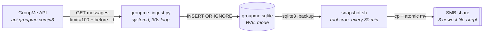

# groupme-exporter

> Continuously archives a GroupMe group chat into a local SQLite database, with periodic snapshots
> to network storage.


GroupMe has no export feature and its API only exposes messages by backward pagination, so the only
way to keep a durable copy of a group is to walk the history once and then re-read the newest pages
forever. This repo does exactly that: a systemd daemon pages backward to the beginning of the group,
then sweeps the six newest pages every 30 seconds and reconciles their likes and reactions, because
GroupMe message IDs are not strictly monotonic and reactions can be *removed* after the fact — a
pure "fetch everything newer than my max ID" loop would silently lose both.

---

## Architecture

Two independent components run on the host. They are deliberately decoupled: ingestion keeps
running when network storage is unavailable, and the snapshot job exits cleanly instead of failing.



| Component | Mechanism | Frequency |
|---|---|---|
| Ingestion daemon | systemd unit `groupme-daemon.service` | Polls the GroupMe API every 30s |
| Snapshot job | root cron → `snapshot.sh` | Backs up SQLite every 30 min |

In the homelab this runs on a dedicated Ubuntu VM, `groupme01`. Nothing about the code is
host-specific — any Linux host with systemd works.

See [docs/architecture.md](docs/architecture.md) for the full runtime flow and host file layout.

---

## Ingestion

`src/groupme_ingest.py` is one program with three routines, run in sequence on every start:

1. **Backfill** — pages backward from the saved checkpoint using `before_id`, 100 messages per
   page, 0.25s between pages. Stops on an empty page, or after two consecutive pages that fail to
   advance `before_id`. The checkpoint row is written after *every* page, so a restart resumes
   where it left off rather than re-walking the history.
2. **Top-off** — re-reads the newest `--head-pages` pages, again by walking `before_id` rather than
   using `since_id`. Stops early after two consecutive pages that insert nothing. This is the part
   that catches new messages in daemon mode.
3. **Reconcile** — for the newest `--reconcile-head` pages, diffs the API's `favorited_by` and
   `reactions` against what is in SQLite and applies both inserts *and deletes*. This is the only
   code path that can remove a like or reaction; top-off alone is insert-only.

In daemon mode the loop is top-off → reconcile → sleep. The sleep is
`max(1, interval - elapsed)`, so `--interval` is a floor on the cycle period, not a fixed schedule:
if a cycle takes longer than the interval, the next one starts immediately.

### Failure handling

Every API call goes through `api_get`, which layers two retry mechanisms:

| Layer | Behavior |
|---|---|
| `urllib3` Retry on the session adapter | `total=5`, `backoff_factor=1.0`, retries on 420, 429, 500, 502, 503, 504 |
| `api_get` loop | Up to 6 attempts, exponential backoff 1s → 30s cap |

The loop backs off on rate-limit and 5xx responses, on SSL/connection/read timeouts, and on
responses that are empty or not `application/json`. Request timeouts are 10s connect, 60s read.

**The non-obvious part:** after exhausting all retries, `api_get` returns `{"messages": []}` — an
empty page. Backfill and top-off both treat an empty page as *end of history*, so a sustained API
outage looks identical to "there is nothing left to fetch". The daemon logs a cycle that added 0
rows and sleeps; it never raises, so systemd `Restart=always` never fires. Use
`src/verify_coverage.py` to detect this, not the exit status.

### Backfill is not re-run from scratch

`ingestion_progress.before_id` only ever moves backward in time. Once the history is exhausted the
checkpoint sits at the oldest message, so every subsequent daemon start issues one API call, gets an
empty page, and proceeds straight to the live loop. If you need to re-walk the history — for example
after restoring an older snapshot — delete the group's row from `ingestion_progress`.

---

## Database schema

SQLite at `<install dir>/groupme.sqlite`, WAL mode, `foreign_keys = ON`. Schema:
[schema/groupme_schema.sql](schema/groupme_schema.sql), applied with `CREATE TABLE IF NOT EXISTS`
on every run.

| Table | Columns | Key |
|---|---|---|
| `groups` | `id`, `name` | PK `id` |
| `members` | `user_id`, `nickname`, `image_url` | PK `user_id` |
| `group_members` | `group_id`, `user_id`, `role` | PK `group_id, user_id` |
| `messages` | `id`, `group_id`, `created_at`, `user_id`, `name`, `text`, `source_guid`, `system` | PK `id` |
| `likes` | `message_id`, `user_id` | PK `message_id, user_id` |
| `reactions` | `message_id`, `type`, `code`, `user_id` | PK `message_id, code, user_id` |
| `attachments` | `id`, `message_id`, `type`, `url`, `lat`, `lon`, `name`, `data` | PK `id` — autoincrement |
| `ingestion_progress` | `group_id`, `before_id`, `ingested_count` | PK `group_id` |

One index: `idx_messages_group_ts` on `messages(group_id, created_at)`.

`created_at` is the raw GroupMe value — Unix epoch seconds, stored as INTEGER. `attachments.data`
holds the full attachment JSON object verbatim, so nothing the API returns is lost even where there
is no dedicated column for it. `messages.system` is 1 for GroupMe-generated events such as a member
join or a group rename.

### Idempotency

Deduplication is entirely `INSERT OR IGNORE` against the primary keys above. `messages.id` is the
dedup key that matters — a message re-read on every one of the six head pages, every 30 seconds,
inserts once and is ignored thereafter.

Two tables do not have that property, which matters if you query them:

- **`attachments` has no unique constraint.** Its primary key is an autoincrement surrogate, so
  `INSERT OR IGNORE` has nothing to conflict on and each head sweep re-inserts rows for the messages
  it re-reads. Deduplicate on `(message_id, type, url)` when reading, or add a unique index.
- **`reactions` keys on `code`, which may be NULL.** SQLite permits NULLs in a non-INTEGER primary
  key, and NULLs never compare equal, so reaction rows with no `code` are not deduplicated either.
  `type` is deliberately not part of the key. Plain likes are unaffected — they land in `likes`,
  which is keyed correctly.

`src/progress.py` already applies the normalization the analysis queries need: it folds a blank or
NULL `code` to `❤️` and unions `likes` with heart `reactions`, since GroupMe reports the same user
action through either field depending on client version.

---

## Configuration

All configuration is environment variables. On the host they live in `/etc/groupme.env`
(mode `0600`, owned by root), which systemd loads via `EnvironmentFile=`. See
[.env.example](.env.example).

| Variable | Read by | Default | Purpose |
|---|---|---|---|
| `GROUPME_TOKEN` | `groupme_ingest.py`, `verify_coverage.py` | none — **required** | GroupMe API token |
| `GROUPME_GROUP_ID` | `groupme_ingest.py`, `verify_coverage.py` | none — **required** | Numeric ID of the group to archive |
| `GROUPME_INSTALL_DIR` | `scripts/install.sh` | `/opt/groupme` | Where the app is installed |
| `GROUPME_DB_PATH` | `scripts/snapshot.sh` | `./groupme.sqlite` | Database to snapshot |
| `GROUPME_TMP_DIR` | `scripts/snapshot.sh` | `./tmp` | Local scratch dir for the backup copy |
| `GROUPME_SNAPSHOT_DEST` | `scripts/snapshot.sh` | `./snapshots` | Snapshot destination — must be a mountpoint |
| `GROUPME_LOCKFILE` | `scripts/snapshot.sh` | `./snapshot.lock` | `flock` file preventing concurrent runs |
| `GROUPME_ERRLOG` | `scripts/snapshot.sh` | `./snapshot.err` | Where `sqlite3` stderr is captured |

Both required variables are checked at import time — the daemon exits immediately with a message if
either is missing, rather than failing later at the first API call.

**The daemon does not read `GROUPME_DB_PATH`.** Its database path is hardcoded to `groupme.sqlite`
next to `groupme_ingest.py`, so it is always `<install dir>/groupme.sqlite`. `GROUPME_DB_PATH` only
tells `snapshot.sh` what to back up; pointing it somewhere else silently snapshots a different file
than the one being written. Note also that the commented-out defaults in `.env.example` are shown as
absolute paths — `/opt/groupme/groupme.sqlite`, `/mnt/groupme_snapshots` and so on — but the
fallbacks actually compiled into `snapshot.sh` are the *relative* paths in the table above, which
resolve against the invoking process's working directory.

### CLI flags

| Flag | Default | Description |
|---|---|---|
| `--daemon` | off | Stay running and poll continuously |
| `--interval N` | `20` | Seconds between polls in daemon mode |
| `--head-pages N` | `3` | Newest pages to scan each cycle |
| `--reconcile-head N` | `0` | Newest pages to reconcile for likes/reactions — 0 disables |
| `--topoff-only` | off | Skip backfill, only sweep the newest pages |
| `--no-topoff` | off | Skip the head sweep after backfill |
| `--test` | off | Stop backfill after ~3 pages |
| `--verbose` | off | Print per-page progress |

The service overrides four of these — it runs `--daemon --interval 30 --head-pages 6
--reconcile-head 6 --verbose`. Six pages at 100 messages each means the daemon re-examines the most
recent ~600 messages on every cycle.

### Tunables compiled into the source

These are module-level constants, not flags. Change them in `src/groupme_ingest.py` or
`scripts/snapshot.sh` and re-run `install.sh`.

| Constant | File | Value |
|---|---|---|
| `PAGE_LIMIT` | `groupme_ingest.py` | `100` — the GroupMe API maximum |
| `MIN_SLEEP` | `groupme_ingest.py` | `0.25` seconds between pages |
| `MAX_RETRIES` | `groupme_ingest.py` | `6` attempts inside `api_get` |
| `DAEMON_DEFAULT_INTERVAL` | `groupme_ingest.py` | `20` seconds |
| `KEEP` | `snapshot.sh` | `3` snapshot files retained |
| `max_attempts` | `snapshot.sh` | `5` backup attempts, 10s apart |

### systemd unit

Generated by `install.sh` from [systemd/groupme-daemon.service](systemd/groupme-daemon.service) by
substituting `%%INSTALL_DIR%%`, and written to `/etc/systemd/system/groupme-daemon.service`.

| Setting | Value |
|---|---|
| `Type` | `simple` |
| `After` / `Wants` | `network-online.target` |
| `EnvironmentFile` | `/etc/groupme.env` |
| `WorkingDirectory` | `$GROUPME_INSTALL_DIR` |
| `Environment` | `PYTHONUNBUFFERED=1` |
| `Restart` / `RestartSec` | `always` / `5` |
| Hardening | `NoNewPrivileges=true`, `ProtectSystem=full`, `ProtectHome=true`, `PrivateTmp=true` |

---

## Repository layout

```
groupme-exporter/
├── src/
│   ├── groupme_ingest.py      # Ingestion daemon — backfill, top-off, reconcile
│   ├── progress.py            # Live counter, refreshes every 15s
│   └── verify_coverage.py     # Completeness check against the API
├── schema/
│   └── groupme_schema.sql     # SQLite schema
├── scripts/
│   ├── install.sh             # Host deploy — venv, file copy, systemd unit
│   └── snapshot.sh            # Database snapshot to network storage
├── systemd/
│   ├── groupme-daemon.service # Unit template — %%INSTALL_DIR%% is substituted
│   └── crontab-root.example   # Example cron entry for snapshots
├── docs/
│   ├── architecture.md        # Full architecture reference
│   └── fstab.example          # Example fstab for SMB snapshot storage
├── .env.example               # All configuration variables — copy to /etc/groupme.env
└── requirements.txt
```

`install.sh` flattens this: `src/*.py`, `schema/*.sql` and `snapshot.sh` all land directly in
`$GROUPME_INSTALL_DIR`, which is why the daemon can resolve its schema and database as siblings of
`groupme_ingest.py`.

---

## Deployment

### Prerequisites

- Linux host with systemd
- Python 3.9 or newer — the pinned `requests` 2.32.5 and `urllib3` 2.5.0 both require it
- The `sqlite3` CLI on `PATH` — `snapshot.sh` refuses to run without it
- A GroupMe API token from [dev.groupme.com](https://dev.groupme.com/)
- The numeric ID of the group to archive

### Finding your group ID

Call the API with your token to list your groups:

```
GET https://api.groupme.com/v3/groups?token=YOUR_TOKEN
```

The `id` field of the group you want is the value for `GROUPME_GROUP_ID`.

### 1. Clone the repo

```bash
git clone https://github.com/vollminlab/groupme-exporter.git
cd groupme-exporter
```

### 2. Configure secrets

```bash
sudo cp .env.example /etc/groupme.env
sudo chmod 600 /etc/groupme.env
sudo chown root:root /etc/groupme.env
sudo nano /etc/groupme.env
```

Fill in `GROUPME_TOKEN`, `GROUPME_GROUP_ID` and `GROUPME_INSTALL_DIR`. Everything else has a
default.

### 3. Run the install script

```bash
sudo bash scripts/install.sh            # or: sudo bash scripts/install.sh /path/to/env/file
```

The script reads `GROUPME_INSTALL_DIR` out of the env file, then:

- copies the source files flat into `$GROUPME_INSTALL_DIR` and creates `tmp/`
- creates a Python venv there if one does not exist and installs `requirements.txt`
- renders `/etc/systemd/system/groupme-daemon.service` from the template
- runs `daemon-reload`, `enable`, `restart`, and prints the resulting status

It is idempotent and is also the update path.

### 4. Set up the snapshot cron

Mount the destination first — `snapshot.sh` checks `mountpoint -q` and skips rather than writing
into an empty directory. [docs/fstab.example](docs/fstab.example) shows the CIFS + bind-mount
pattern used here. Then install the root cron entry from
[systemd/crontab-root.example](systemd/crontab-root.example):

```bash
sudo crontab -e
```

```
*/30 * * * * /opt/groupme/snapshot.sh >>/var/log/groupme_snapshot.log 2>&1
```

**cron does not read `/etc/groupme.env`.** Only systemd does, and only for the daemon. That line as
written gives `snapshot.sh` no `GROUPME_*` variables at all, so it falls back to its relative
defaults and looks for `./groupme.sqlite` in root's home directory. Either declare the variables in
the crontab itself above the schedule line, or source the env file in the command:

```
*/30 * * * * set -a; . /etc/groupme.env; set +a; /opt/groupme/snapshot.sh >>/var/log/groupme_snapshot.log 2>&1
```

### Updating the host

```bash
git pull
sudo bash scripts/install.sh
```

---

## Snapshots

`snapshot.sh` runs as root from cron and produces a consistent copy of a live, WAL-mode database —
a plain `cp` of `groupme.sqlite` while the daemon is writing would not be safe.

1. Verifies `sqlite3` exists and the database file is present; exits 1 if not.
2. Verifies the destination is a mountpoint *and* writable, via a `.writetest` touch. If either
   check fails it logs and **exits 0** — an unreachable NAS is not treated as an error.
3. Takes an exclusive `flock` on the lockfile; a second concurrent run exits 0 immediately.
4. Runs `sqlite3 .backup` into `$GROUPME_TMP_DIR` with a 30s busy timeout, retrying up to 5 times
   at 10s intervals, then rejects a zero-byte result.
5. Copies to the destination as `groupme_<TS>.sqlite.partial` and `mv -f`s it into place, so
   readers never observe a half-written file. Stale `.partial`/`.tmp` files are swept first.
6. Copies that to `groupme_latest.sqlite` — a stable filename for downstream BI tools.
7. Prunes to the newest `KEEP=3` files.

Output goes to stdout — captured by the cron redirect into `/var/log/groupme_snapshot.log` — and
also to syslog under the tag `groupme-snapshot`.

Two things to know about the tail end of that run:

- **`groupme_latest.sqlite` counts against retention.** The prune globs `groupme_*.sqlite`, which
  matches the stable copy as well as the timestamped ones, so what actually survives is roughly two
  timestamped snapshots plus `groupme_latest.sqlite` — not three timestamped snapshots. It is a
  copy, not a symlink, so the destination holds two full copies of the newest database.
- **The script currently exits 2 after finishing.** A stray heredoc terminator on its last line
  makes bash report `unexpected EOF while looking for matching` once it reaches the end of the
  file. Every command above it has already run and the snapshot is complete and correct, but cron
  sees a non-zero exit. Do not read that as a failed backup — check the log's `Snapshot complete`
  line instead.

---

## Operations

```bash
# Daemon status and live logs
sudo systemctl status groupme-daemon
sudo journalctl -u groupme-daemon -f

# Snapshot log
tail -f /var/log/groupme_snapshot.log

# Live row counts — refreshes every 15s, Ctrl-C to exit. Must run from the install dir:
# progress.py opens "groupme.sqlite" relative to the working directory.
cd /opt/groupme && venv/bin/python progress.py

# Completeness check against the API. Needs GROUPME_TOKEN and GROUPME_GROUP_ID in the
# environment — it does not read /etc/groupme.env on its own.
cd /opt/groupme && set -a && . /etc/groupme.env && set +a && venv/bin/python verify_coverage.py
```

`verify_coverage.py` is the real health check: it asks the API for messages older than the oldest
row and newer than the newest row, and spot-checks the latest 200 API messages against the
database. All three numbers should be 0. A non-zero "missing in DB" count is the signal that
ingestion has silently stalled — the daemon itself will not tell you.

### Manual runs

```bash
cd /opt/groupme && set -a && . /etc/groupme.env && set +a

venv/bin/python groupme_ingest.py                  # one-time full sync, resumes from checkpoint
venv/bin/python groupme_ingest.py --test           # backfill 3 pages only
venv/bin/python groupme_ingest.py --topoff-only    # head sweep, no backfill
```

Stop the service first if you are running a long backfill by hand — both processes writing the same
WAL database will contend on the write lock.

---

## Security

- `GROUPME_TOKEN` and `GROUPME_GROUP_ID` live only in `/etc/groupme.env`, mode `0600`, owned by
  root. Store the token in 1Password; it is never in the repo, and `.gitignore` excludes `*.env`,
  `*.sqlite`, `venv/`, and the rendered `groupme-daemon.service`.
- The GroupMe API takes the token as a **query parameter**, not a header, so it appears in full
  request URLs. Do not paste raw request URLs into logs or issues, and treat any HTTP debug output
  as containing the credential.
- The service runs with `NoNewPrivileges`, `ProtectSystem=full`, `ProtectHome` and `PrivateTmp`.
- The snapshot cron runs as root because it writes to a root-mounted SMB share; the SMB credentials
  live in `/etc/smb-creds`, referenced from `/etc/fstab`.

---

## License

MIT — see [LICENSE](LICENSE).
